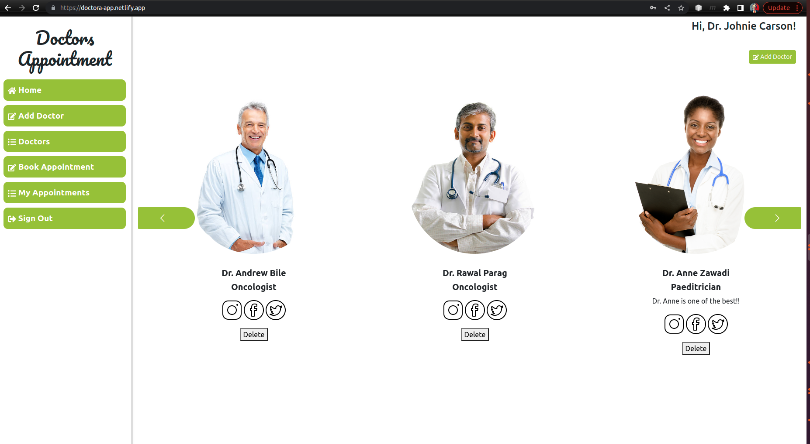

# Doctors Appointment Front-end



> This web application is the API that serves as the front-end to the [Doctor-appointment-back-end](https://github.com/silviatofana/Doctor-appointment)

## Back-end Repository
| Repository | Pull request |
|------------|------------|
|[Repo link >>](https://github.com/silviatofana/Doctor-appointment)|[Pull request Here >>](https://github.com/silviatofana/Doctor-appointment/pull/32)|

## Team members: @felix45, @henrycode460, @silviatofana

## Live demo
[Click here for live demo >>](https://doctora-app.netlify.app/)

## Built With

- Major: Ruby
- Frameworks: `Rails`
- Technologies: Git, Gitflow, Linters, Github, PostgreSql, Rubocop


## Getting Started
To get a local copy up and running follow these simple example steps.

### Prerequisites
- Have a computer and internet connection
- Have a basic knowledge of `React` and `OOP` concepts
- Have a general understanding of what testing is
- Have `visual-studio code` or any other code editor installed on your computer.

### Setup
- In order to get a copy of this project you need to download it from git@github.com:silviatofana/Doctor-appointment.git
- Extract the zipped file and open it in your code editor
### Install
- Run the command bellow in your terminal to get all required files
```
$ npm install
```

### Setup Application locally
> To setup the application locally run the following command
```
 $ npm run start
``` 

### Run tests
you can run one of the following command in your terminal
1. Run testing
```
 $ npm test
```

## Authors

👤 **Silvia Tofana**

- GitHub: [@githubhandle](https://github.com/silviatofana)
- Twitter: [@twitterhandle](https://twitter.com/silviatofana)
- LinkedIn: [LinkedIn](https://www.linkedin.com/in/silviatofana/)


👤 **Felix Ouma**

- GitHub: [@Felix45](https://github.com/Felix45)
- Twitter: [@Felix_Atonoh](https://twitter.com/Felix_Atonoh)
- LinkedIn: [LinkedIn](https://www.linkedin.com/in/felix-ouma/)


👤 **Henry V. Singhbeh**

- GitHub: [@henrycode460](https://github.com/henrycode460)
- Twitter: [@460code](https://twitter.com/460code)
- LinkedIn: [LinkedIn](https://www.linkedin.com/in/henry-varflay-singbeh-75707b229/)

## 🤝 Contributing

Contributions, issues, and feature requests are welcome!
Feel free to check the [issues page](../../issues/).
## Show your support

Give a ⭐️ if you like this project!

## Acknowledgments

- Hats off to the whole microverse community
- credit to Murat Korkmaz for the design [behance.net](https://www.behance.net/gallery/26425031/Vespa-Responsive-Redesign )
.


## License 

This project is [MIT](LICENSE) licensed.
